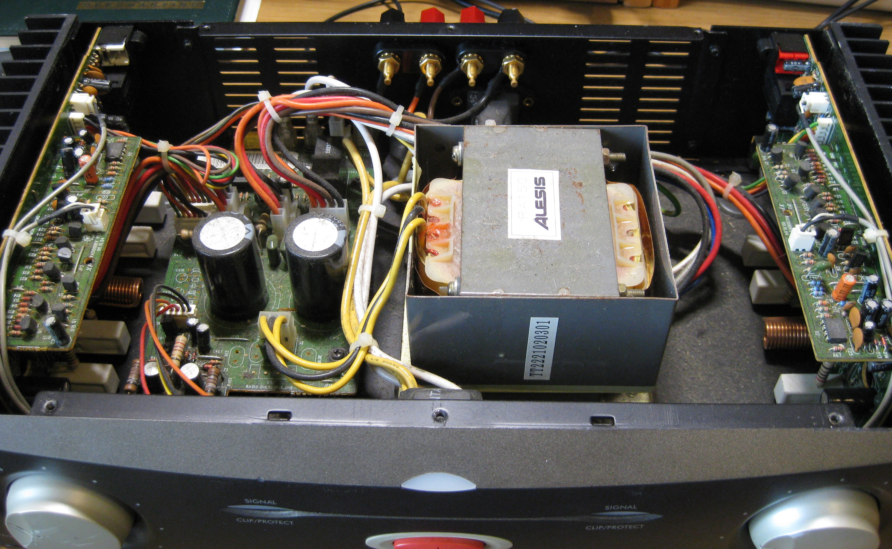
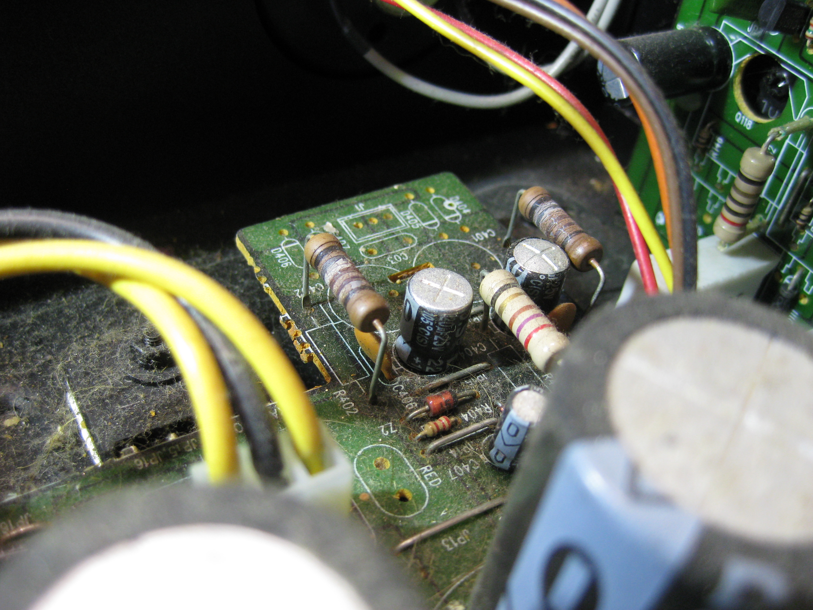
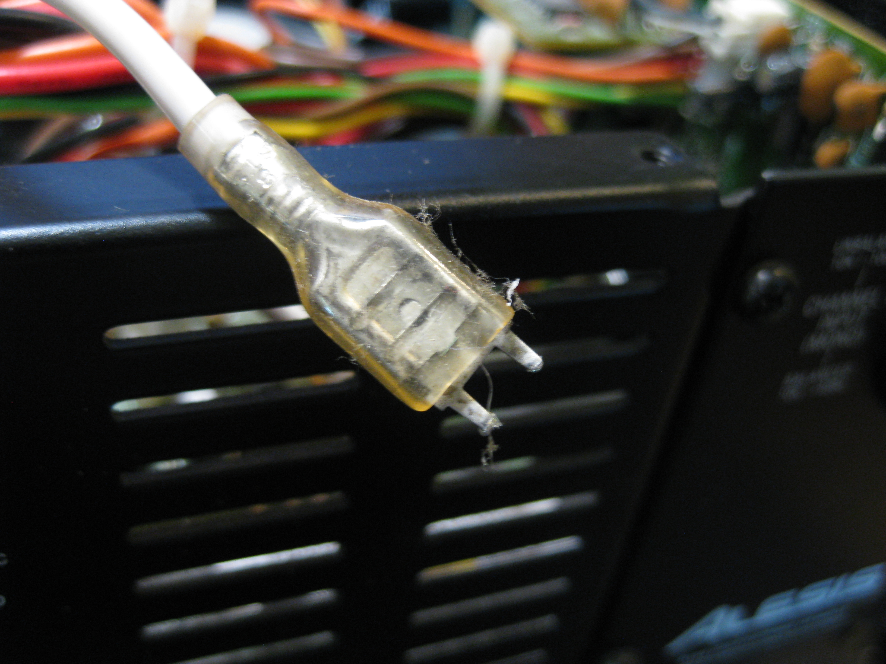
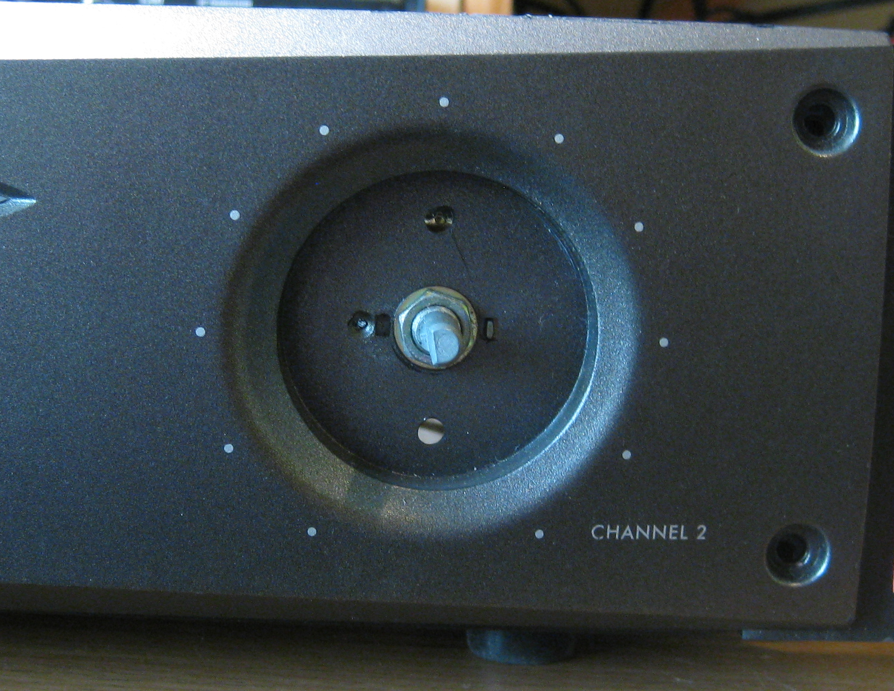
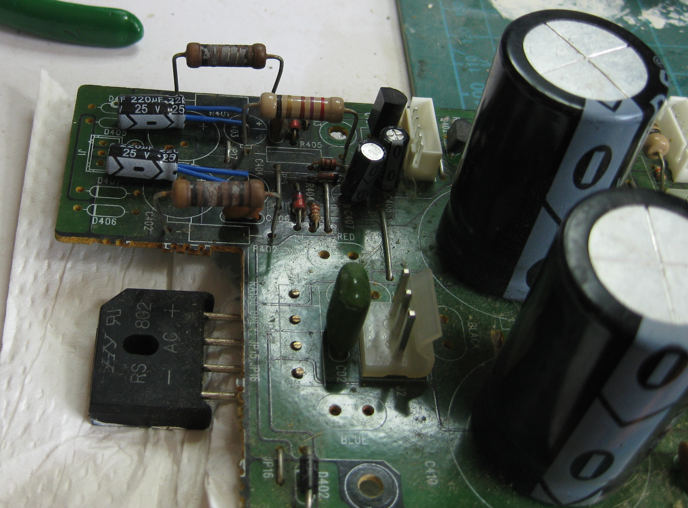
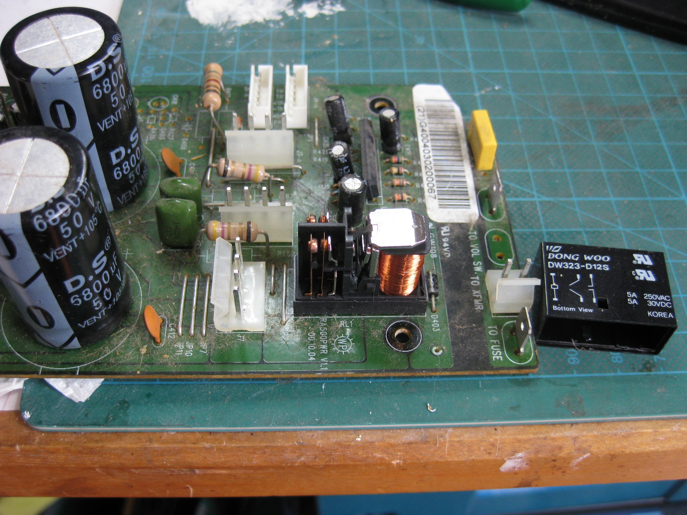
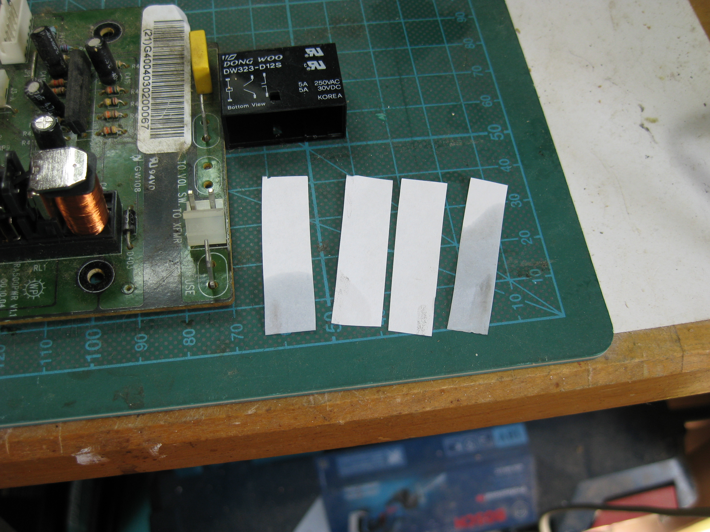
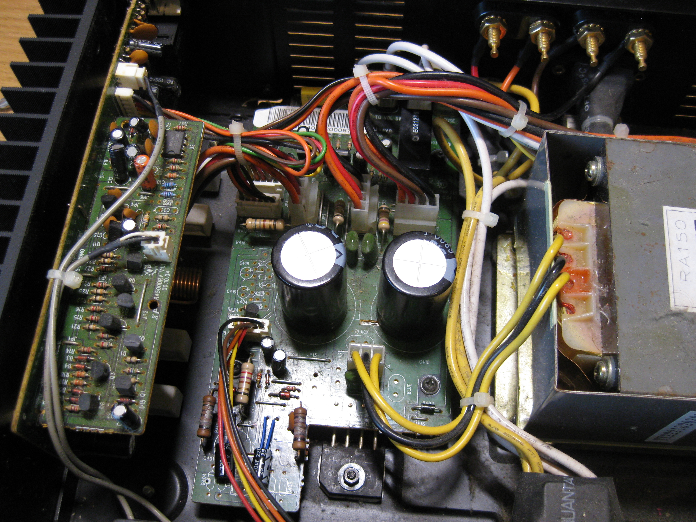

# Alesis RA150 amplifier maintenance

> **WARNING, DANGER OF DEATH**
>
> Got your attention? OK, there are mains level voltages present in your amplifier, and
> doing the wrong thing could have dire consequences, from electric shock to fire or more.
> Warning and waiver then - if you don't know what you are doing, then maybe you should not
> go meddling inside the amplifier. No warranty or guarantees are provided with this document.
>
> OK, warning over, now on with the fun stuff.

I recently acquired an [Alesis RA150](https://www.alesis.com/products/legacy/ra150) amplifier
second hand from a 'well known auction site'. I wanted a replacement amplifier for my desk, and
as there is a small mixing unit on my desk I use for device selection, I literally only needed
a two channel amp. The RA150 turned up at the right price.

This unit is, shall we say, 'classic', as indicated by the link the the Alesis site. The PDF
manual I downloaded is dated 2000.

On unpacking the amplifier there was only one apparent non-critical problem - the right hand
volume knob was wobbly, but functional. I suspected maybe a broken shaft on the potentiometer,
possibly during transit. No worries, I expected to set the volume once and leave it, and set the
level from the mixing desk.

After a couple of days I noticed the left channel cut in and out and crackled a bit. A quick
internet surf showed this was a pretty common issue, and likely to be the output protection
relay failing due to corrosion etc. A quick 'tap' on the unit fixed it, but it re-occurred after
a while. It could also easily be a bad or loose internal connection, or wear or corrosion of the
volume potentiometers. Eventually I decided it was time to have a look...

## Dismantaling

Time to take it apart. Remove the six screws on the top (note, the three at the back have
washers and the three at the front do not), and also remove the two screws at the top of the
heatsink on either side. Now ease the top panel off - mine was quite stiff, being wedged
between the heatsinks.

I already knew where to look for the relay. It's at the back of the power supply board on the
left hand side. You can just see it nestling by a yellow wire.

Something else I wanted to check whilst in the amplifier was the condition of the electrolytic
capacitors. They do not last for ever, and are prone to drying out and 'bloating'. If you find
swolen or leaky electrolytics, then replace them.

## Faults found

The good news was there was nothing drastically obvious. Nothing had exploded or leaked, nothing
was dangling or loose. My initial plan was to see if I could service the relay 'in place', without
having to de-solder it, and to give the volume potentiometers a spray with contact cleaner. I'd also
probably disconnect and re-seat a number of connectors if I thought that might give them an impromtu
clean. And then, there it was, a swollen capacitor (the one on the right):

OK, well, that means I need to take the board out to replace the capacitor.
Checking the service manual (which you can
probably locate using your browser skills), and reading the capacitor, that is a 220uF 25v
electrolytic that is part of the 15v voltage regulation circuit. Hmm, I don't like the look of those
power resistors next to it, and the browning of the board in the general area. The unit does get
warm around about that area on the lid. It is not clear to me if the heating is cause or
effect? Do the resistors get warm and thus may have dried out the capacitor, or did the capacitor
dry out and the change in its specifications, causing the resistors to warm up more than designed?

Well, I suspect the latter. From a quick study of how a zenner shunt regulator circuit works, I think
if you are not pulling much power then the 'excess' is soaked up by those power resistors (they
limit how much current can flow through the zenner to prevent blowing it). They are
probably designed to run warm. Looks like a potential design oversight to place them right next to
the capacitors though, even if the capacitors are rated to 105C. If I had some spare larger power
resistors of the correct capacity to hand I'd probably go ahead and replace them while I had the
board on the bench.

I should probably make mention of how you get the board out at this point. There are four screws
holding the board down to the chassis, and the rectifier is bolted to the chassis as well. Undo those
five screw/bolts. All the cables to the board are via push on connectors. Some have a latch that is
very easy to release by sliding a slim flat screwdriver down the side. Disconnect all the cables,
and ease the board out.

Whilst dismantaling the board, the push on spade connectors for the mains input are very tight.
Tight enough that one of them pulled the spade out of the board!

Right, one more thing to fix.

And then the final thing to check - do we have a broken shaft on the right hand volume dial or ???
Well, luckily no breakage. It is just a loose retaining nut. A quick tighen with a spanner fixed
that in short order. Note, you don't have to take any bolts out of the front panel - the volume
dial just pulls off. They are quite a tight fit though.

## Fixing up

First the capacitors then. Searching my stash I had 220uF 25v to hand. Ideally I'd probably have
gone with a higher voltage one if I had them, just to add a touch more robustness, but I did not.

Whilst there the, let's see if we can get those capacitors further away from those hot resistors:

I cleaned up and replaced the power lug whilst I had the soldering iron hot.

And then onto the relay. Looking at the case there are a couple of little lugs that hold the
case on. Judicous application of an appropriate prodding tool and a little wiggle to the case,
and voila, the relay is exposed whilst in-situ:

Before I lube it up with some contact cleaner, we'll see if there is some detectable dirt or
corrosion on the contacts. Take some paper, rub it through the closed contacts (both sets, you'll
have to 'push' the relay over to do the normally open ones, which are actually the ones we are
mostly interested here). Then do the same with some paper with a touch of contact cleaner
on it. Here you can just about see the dirt that lifted off left on the paper:

## Results...

OK, job done. Now, reverse your steps to get the board back in. Make sure there is still some
heatsink compound (grease) under the rectifier that is bolted to the chassis. Add more if
necessary. The leads all go back pretty easy and are hard to mix up - but, just in case, you did
take lots of digital photos to reference whilst taking your amplifier apart, didn't you?

All back together - time to test. And, mine powered up and works, so far. No crackles and cutting
out yet, but I suspect it will take a little while for the contact cleaner to really soak in
and do its thing on the volume potentiometers and the relay contacts. Fingers crossed to another
20 years of service I say...

## An update

Twelves months later I started to experience oddities in my audio chain again. This time channels
would cut in and out or fade away over time. I first thought it was maybe dirty pots in my mixer,
but after some time I realised it could be the amp again. One clue was that turning the volume up
would bring channels back to life - a classic sign of a dry or dirty joint.
The big clue was when I physically tapped on the front of the amplifier and it would change which
channel was playing and how well... hmm. Now, what do we think could cause a dirty or dry intermittent
contact in the amplifier? Well, there are quite a lot of push fit connectors in there, but the item
that immediately jumps out would be that damned relay again!

After a few months of putting up with twiddling the volume and hitting the amp I finally found a slot
to take the amp apart again and have a look.

Long story short, I cleaned the relay contacts again and now all is hunky dory and stable. We'll see
how long that lasts. It might last longer this time, as I took a slightly different, but similar,
route as last time.

Last time I cleaned the contacts I used
[Servisol Super 10](http://www.crcind.com/csp/web/ProdDisp.csp?lng=3&idx=2891050&country=GB&product=SOL%20SUPER%2010&brand=SERVISOL)
switch cleaner - probably the most common switch cleaner in the U.K. I've been using this since literally
I was a boy. I have a feeling though that maybe Servisol is more for sliding switch contacts (even
though the literature says it can be used on relays). This time I thought I'd seek out some alternative
cleaner. They are surprisingly hard to find. What I wanted to try was some
[DeoxIT](https://caig.com/deoxit-d-series/), which has a good reputation, but it's not that easy to find
in the U.K., and when you do, it sure ain't cheap!

After some more searching I ended up getting some
[Electrolube EML](https://electrolube.com/product/eml-contact-cleaner-lubricant/) Contact Cleaner
Lubricant, and the matching [Electrolube CCS](https://electrolube.com/product/ccs-contact-cleaning-strips/)
Contact Cleaning Strips, which are as far as I can tell mildly abrasive strips impregnated with a
speciality Contact Lubricant. First I used some EML on some normal paper to give the contacts an initial
clean (and a little bit of grime came off), and then I used the CCS strip to give them a better clean
and a tiny coating of lubricant - and a lot more 'dirt' came off! I say dirt, as it might be that the
strips are abrasive enough to remove tiny bits of the contacts themselves (that is, burnish and polish
them). Anyhow, this is what the strips are designed for, so I have little concern that they are eroding
the contacts.

And the results - so far so good. Crystal clear again, and not tapping or adjusting of the volume so
far makes any difference to the sound.

Fingers crossed I won't have to undertake this procedure in another year. That would be annoying, and
in the end I'd be looking to see if I needed to replace the relay with a better quality one.
on the front of the amp the channels
